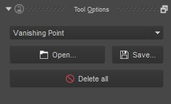

Assistant Tool
==============

Create, edit, and remove drawing assistants on the canvas. There are a
number of different assistants that can be used from this tool. The tool
options allow you to add new assistants. To add an assistant, select a
type from the tool options and begin clicking on the canvas. Each
assistant is created a bit differently. There are also additional
controls on existing assistants that allow you to move and delete them.

Check :doc:`Painting With Assistants <Painting_With_Assistants>` for more information.

Tool Options
------------

