Clipping Masks and Alpha Inheritance
====================================

Krita doesn't have clipping mask functionality in the manner that
Photoshop and programs that mimic Photoshop's functionality have. That's
because in Krita, unlike such software, a group layer is not an
arbitrary collection of layers.

Rather, in Krita Group layers are composited separately from the rest of
the stack and then the result is added into the stack. In other words,
in Krita group layers are in effect a separate image inside your image.

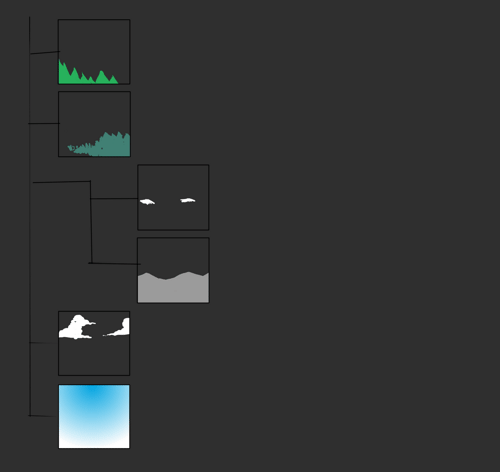

The exception is when using pass-through mode, meaning that alpha
inheritance won't work right when turning on pass-through on the layer.

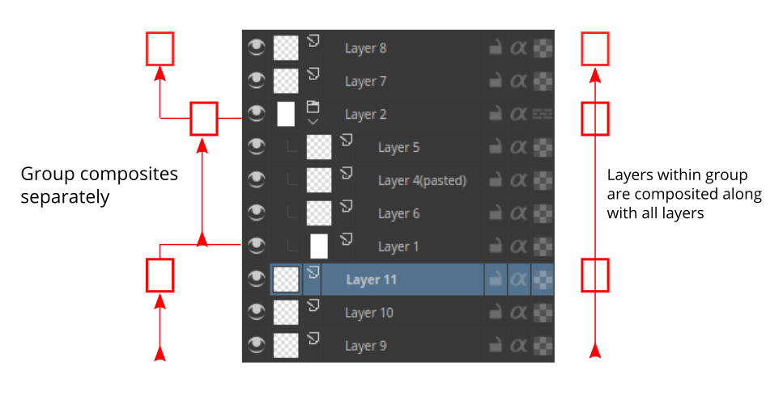

When we turn on alpha inheritance, it takes the transparency of the
layers below and doesn't change it when adding the alpha inherited
layer.

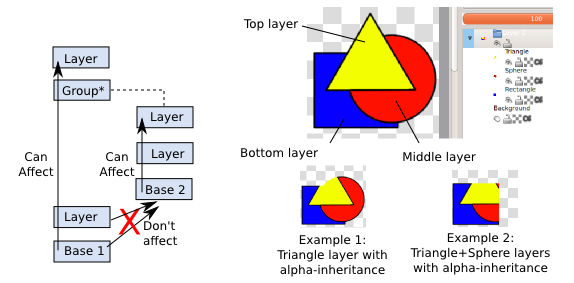

Combined with group layers this can be quite powerful.

A situation where this is particularly useful is the following:

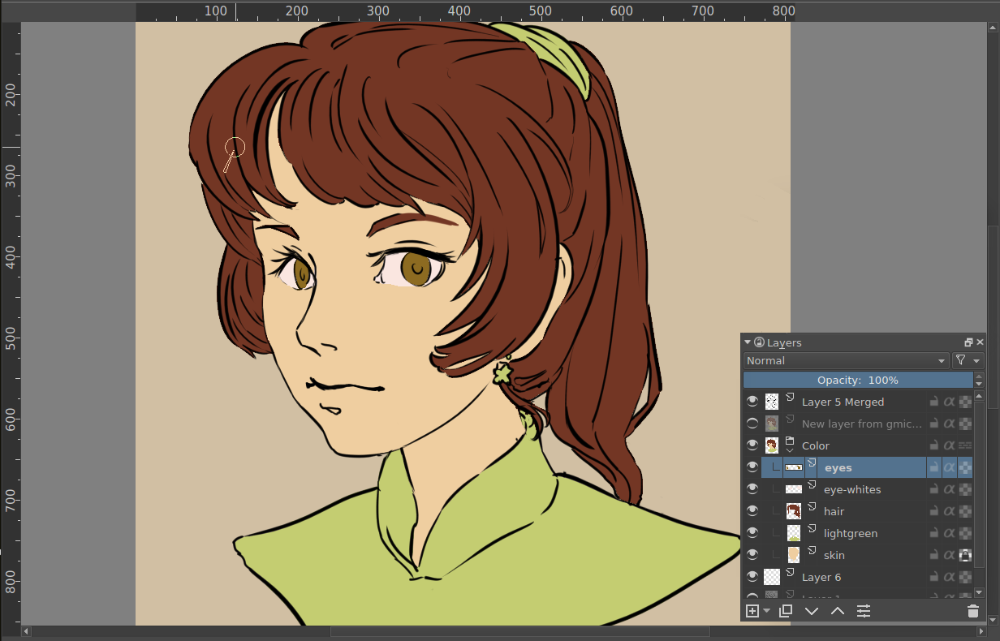

Here we have an image with line art and a layer for each flat of colors.
We want to add complicated multi-layered shading to this, while keeping
the neatness of the existing color flats.

To get a clipping mask working, you first need to put layers into a
group. You can do this by making a group layer and drag and dropping the
layers into it, or by selecting the layers you want grouped and pressing
Ctrl+G. Here we do that with the iris and the eye white layers.

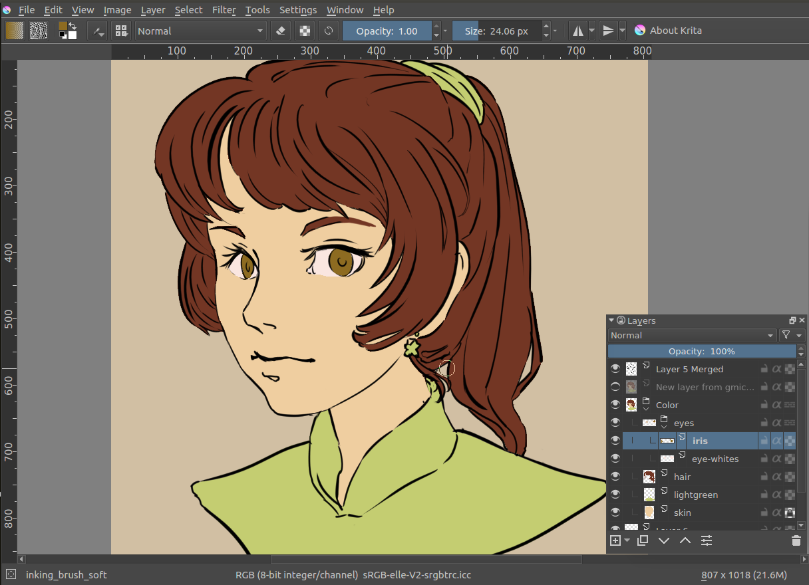

We add a layer for the high-light above the layers, and add some white
scribbles.

|Tut_Clipping_3.png| |Tut_Clipping_4.png|

In the above, we have our layer with a white scribble on the left, and
on the right, the same layer, but with alpha inheritance active,
limiting it to the combined area of the iris and eye-white layers.

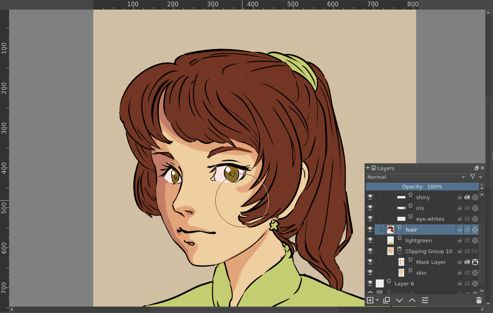

Now there’s an easier way to set up alpha inheritance. If you select a
layer or set of layers, and press ctrl+shift+g, you create a quick
clipping group. That is, you group the layers and there’s a ‘mask layer’
added on top with alpha inheritance set.

|Tut_Clipping_6.png| |Tut_Clipping_7.png|

The fact that alpha inheritance can use a combination of layers's
composited transparency, means that you can have a layer with the
erase-blending mode in between, and have that affect the area that the
layer above is clipped to.

Above, the image of the right is exactly the same as the left, except
with the erase-layer hidden.

Filters can also affect the alpha inheritance:

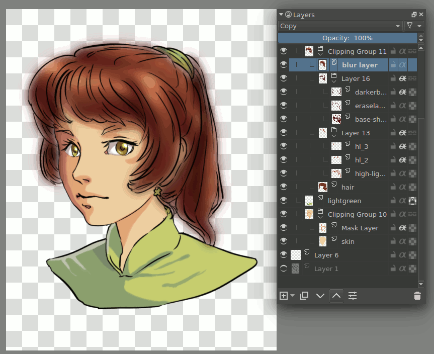

Above the blur filter layer in different places gives different results,
due different parts being blurred.

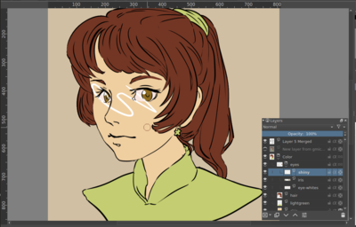
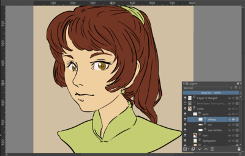
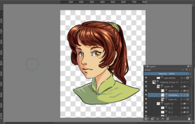
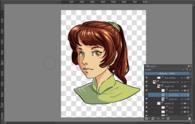

