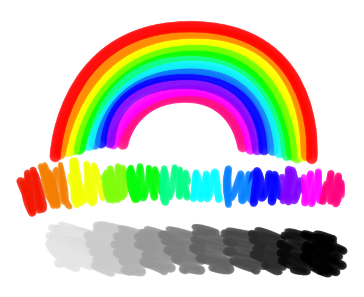
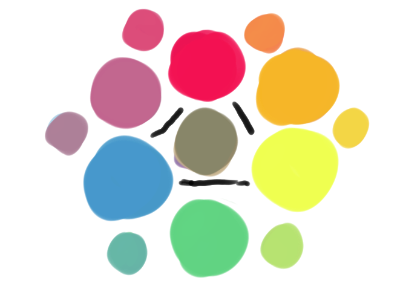
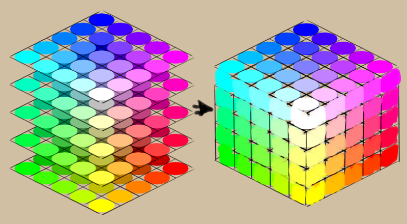
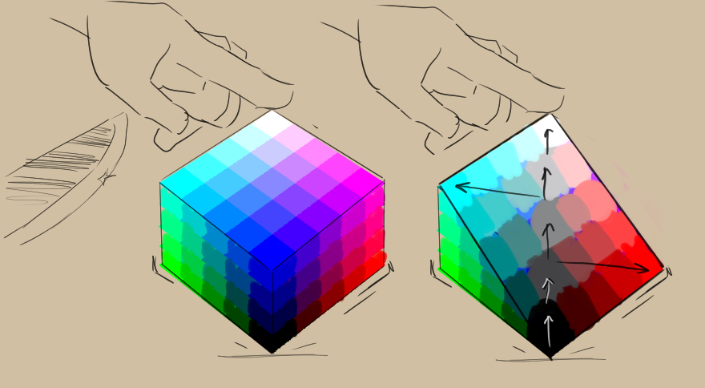

Color
=====

Okay, so, colors.

Colors are pretty, and they're pretty fundamental to painting. So, when
we are painting, we want to be able to access colors easily and do fun
stuff with them, like mixing. And we want to be able to quickly find our
red and blue, without thinking too hard. And this becomes even more
important the more colors we have access to.

So, the first thing we do is organize our colors. We usually base this
on systems we see in nature. For example, we tend to order hues by the
order given to us by rainbows, and the brightness of greytints as a
tonal range, from white to black.

In the case of traditional media, we order colors by how they result
from mixes of other colors, starting with the primaries.

For computers, this is similar, and we order colors by the way the
screen generates them: Each color on the screen can be produced by
combining red, green and blue lights of varying intensities. So we can
try to make a list of possible intensities, and show the color that
produces:

+----------+-----------+-----------+-----------+------------+
| 0% Red   | 25% Red   | 50% Red   | 75% Red   | 100% Red   |
+----------+-----------+-----------+-----------+------------+

Eventually, you start to systematically add more color variations, for
example, what if we order Red and Green like a table:

+--------------+----------+-----------+-----------+-----------+------------+
|              | 0% Red   | 25% Red   | 50% Red   | 75% Red   | 100% Red   |
+==============+==========+===========+===========+===========+============+
| 0% Green     |          |           |           |           |            |
+--------------+----------+-----------+-----------+-----------+------------+
| 25% Green    |          |           |           |           |            |
+--------------+----------+-----------+-----------+-----------+------------+
| 50% Green    |          |           |           |           |            |
+--------------+----------+-----------+-----------+-----------+------------+
| 75% Green    |          |           |           |           |            |
+--------------+----------+-----------+-----------+-----------+------------+
| 100% Green   |          |           |           |           |            |
+--------------+----------+-----------+-----------+-----------+------------+

And then, we can make multiple of these tables to count in blue as well:

+--------------+----------+-----------+-----------+-----------+------------+
| 0% Blue      | 0% Red   | 25% Red   | 50% Red   | 75% Red   | 100% Red   |
+==============+==========+===========+===========+===========+============+
| 0% Green     |          |           |           |           |            |
+--------------+----------+-----------+-----------+-----------+------------+
| 25% Green    |          |           |           |           |            |
+--------------+----------+-----------+-----------+-----------+------------+
| 50% Green    |          |           |           |           |            |
+--------------+----------+-----------+-----------+-----------+------------+
| 75% Green    |          |           |           |           |            |
+--------------+----------+-----------+-----------+-----------+------------+
| 100% Green   |          |           |           |           |            |
+--------------+----------+-----------+-----------+-----------+------------+

+--------------+----------+-----------+-----------+-----------+------------+
| 25% Blue     | 0% Red   | 25% Red   | 50% Red   | 75% Red   | 100% Red   |
+==============+==========+===========+===========+===========+============+
| 0% Green     |          |           |           |           |            |
+--------------+----------+-----------+-----------+-----------+------------+
| 25% Green    |          |           |           |           |            |
+--------------+----------+-----------+-----------+-----------+------------+
| 50% Green    |          |           |           |           |            |
+--------------+----------+-----------+-----------+-----------+------------+
| 75% Green    |          |           |           |           |            |
+--------------+----------+-----------+-----------+-----------+------------+
| 100% Green   |          |           |           |           |            |
+--------------+----------+-----------+-----------+-----------+------------+

+--------------+----------+-----------+-----------+-----------+------------+
| 50% Blue     | 0% Red   | 25% Red   | 50% Red   | 75% Red   | 100% Red   |
+==============+==========+===========+===========+===========+============+
| 0% Green     |          |           |           |           |            |
+--------------+----------+-----------+-----------+-----------+------------+
| 25% Green    |          |           |           |           |            |
+--------------+----------+-----------+-----------+-----------+------------+
| 50% Green    |          |           |           |           |            |
+--------------+----------+-----------+-----------+-----------+------------+
| 75% Green    |          |           |           |           |            |
+--------------+----------+-----------+-----------+-----------+------------+
| 100% Green   |          |           |           |           |            |
+--------------+----------+-----------+-----------+-----------+------------+

+--------------+----------+-----------+-----------+-----------+------------+
| 75% Blue     | 0% Red   | 25% Red   | 50% Red   | 75% Red   | 100% Red   |
+==============+==========+===========+===========+===========+============+
| 0% Green     |          |           |           |           |            |
+--------------+----------+-----------+-----------+-----------+------------+
| 25% Green    |          |           |           |           |            |
+--------------+----------+-----------+-----------+-----------+------------+
| 50% Green    |          |           |           |           |            |
+--------------+----------+-----------+-----------+-----------+------------+
| 75% Green    |          |           |           |           |            |
+--------------+----------+-----------+-----------+-----------+------------+
| 100% Green   |          |           |           |           |            |
+--------------+----------+-----------+-----------+-----------+------------+

+--------------+----------+-----------+-----------+-----------+------------+
| 100% Blue    | 0% Red   | 25% Red   | 50% Red   | 75% Red   | 100% Red   |
+==============+==========+===========+===========+===========+============+
| 0% Green     |          |           |           |           |            |
+--------------+----------+-----------+-----------+-----------+------------+
| 25% Green    |          |           |           |           |            |
+--------------+----------+-----------+-----------+-----------+------------+
| 50% Green    |          |           |           |           |            |
+--------------+----------+-----------+-----------+-----------+------------+
| 75% Green    |          |           |           |           |            |
+--------------+----------+-----------+-----------+-----------+------------+
| 100% Green   |          |           |           |           |            |
+--------------+----------+-----------+-----------+-----------+------------+

This way of ordering colors is probably familiar to you if you have used
programs for making internet applications like Flash. In fact, if we had
made 6 samples instead of 5 per channel(per, red, green and blue), we'd
have gotten the `216 websafe colors <https://websafecolors.info/color-chart>`__.

It’s a bit odd, but you can actually stack these tables until the blue
is lined up. It’ll become a cube then!

This cube is not filled with water, or sand, but just colors. And colors
are pretty abstract. And we typically talk about cubes and other 3d
objects that are filled with abstract objects as spaces, so hence we
call this RGB cube a *color space*.

That the cube used red, green and blue as it’s axes, means that we can
say that the model we have our cube in is the RGB `*color model* <Special:MyLanguage/Color_Models>`__.

There’s many more color models, for example, we can let the cube stand
on the corner where the color black is. The most opposite corner that
points to above would then be white. And as geometry and maths would
have it, if we cut the cube in half, the line from the white point to
the black point would be the gray scale.

We can then say that from the middle of the cube to it’s ends, we can
talk about the saturation of a color.

The circumference of the colors around it’s middle axis of gray would
then define the hue.

This would be the base logic that `HSV, HSL, HSI, and HSY <Special:MyLanguage/Color_Models>`__ 
are based on. This particular
model is HSI, because of the way it maps a color to the intensity it
would have based on bright the red, green and blue lights have to shine
for a color.

There are other color models, like
`LAB <Special:MyLanguage/Color_Models>`__, where we look at the
corresponding gray value of a color first, and then try to describe it’s
hue and saturation not it terms of hue and saturation, but in terms of
how red, green, blue and yellow a color is, because our brains cannot
comprehend a color that is both green and red, or yellow and blue,
making them into good sliding scales. We call this a perceptual model.

Color models describe color spaces, which in turn are all sorts of sizes
as well. Krita allows you to do operations in different models and
spaces, and we call this functionality ‘\ *Color Management*\ ’.

Color management is necessary for
`CMYK <Special:MyLanguage/Color_Models>`__ support, but outside of that,
not many drawing programs offer the feature, as developers believe that
artists have no need for such functionality. Which is a pity, because it
allows for far more cool tricks than just CMYK support, and the ability
to manipulate colors like a computer can is perhaps digital painting’s
most unique quality.

This means that there’s little to no articles on how to use color
management for artists painting from scratch. So we made this category,
and hope to fill it up with little articles explaining color related
concepts in a visual manner.

We recommend going over the `color managed workflow
page <Special:MyLanguage/Color_Managed_Workflow>`__ next, even if you
will not use any of it, it’ll make some sense out of the many features
related to it. Other than that, each article should stand on it’s own.

