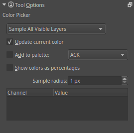

Color Selector Tool
===================

The Color Picker tool allows you to choose a point from the canvas and
make the color of that point the active foreground color. When a paint
or drawing tool is selected the dropper tool can be quickly accessed by
pressing :kbd:`Ctrl`.

There are several options for the dropper tool in the Tool Options dock.
The first drop down box allows you to select whether you want to sample
all visible layers or only the active layer. You can choose to have your
selection update the current foreground color. You can choose to add any
colors selected by the dropper into a color palette. One other option is
to set a sample radius, which will average the colors in the area around
the cursor.

