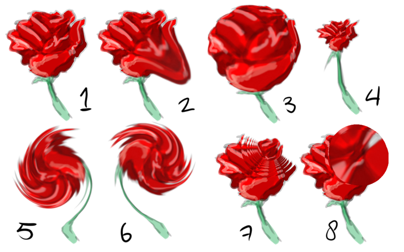
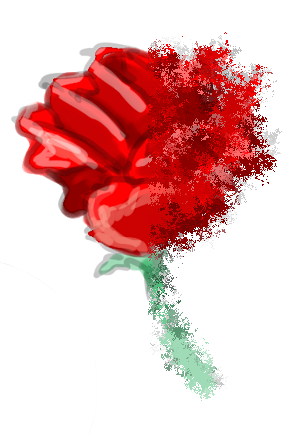
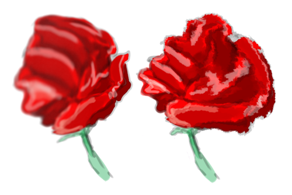
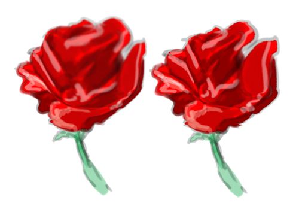

Deform
======

The Deform Brush is a brush that allows you to pull and push pixels
around. It's quite similar to the `liquefy transform
mode <Special:myLanguage/Transform_Tool>`__, but where liquefy has
higher quality, the deform brush has the speed.

Reference
---------

Parameters
~~~~~~~~~~

-  `Brush-tips <Special:MyLanguage/Brush_Tips>`__
-  `Deform Options <Special:MyLanguage/Deform#Deform_Options>`__
-  `Blending Modes <Special:MyLanguage/Blending_Modes>`__
-  `Opacity and Flow <Special:MyLanguage/Opacity_&amp;_Flow>`__
-  `Size <Special:MyLanguage/Parameters#Size>`__
-  `Rotation <Special:MyLanguage/Parameters#Rotation>`__
-  `Airbrush <Special:MyLanguage/Parameters#Airbrush>`__

Deform Options
~~~~~~~~~~~~~~

   1: undeformed, 2: Move, 3: Grow, 4: Shrink, 5: Swirl Counter Clock
   Wise, 6: Swirl Clockwise, 7: Lens Zoom In, 8: Lens Zoom Out

These decide what strangeness may happen underneath your brush cursor.

Grow
    This bubbles up the area underneath the brush-cursor.
Shrink
    This pinches the Area underneath the brush-cursor.
Swirl Counter Clock Wise
    Swirls the area counter clock wise.
Swirl Clock Wise
    Swirls the area clockwise.
Move
    Nudges the area to the painting direction.
Color Deformation
    This seems to randomly rearrange the pixels underneath the brush,
Lens Zoom In
    Literally paints a enlarged version of the area.
Lens Zoom Out
    Paints a minimized version of the area.

Deform Amount
    Defines the strength of the deformation.

Bilinear Interpolation
    Smoothens the result. This causes calculation errors in 16bit.
Use Counter
    Slows down the deformation subtlety.

   Without 'use undeformed' to the left and with to the right

Use Undeformed Image
    Samples from the previous version of the image instead of the
    current. This works better with some deform options than others.
    Move for example seems to almost stop working, but it works really
    well with Grow.

