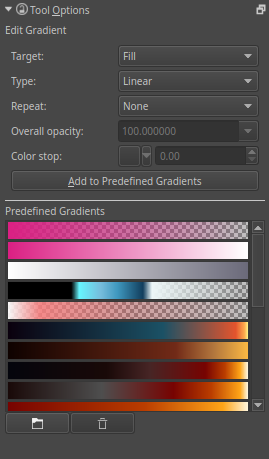

Gradient Editing Tool
=====================

.. raw:: mediawiki

   {{ToolIcon|gradient-edit}}

This tool allows you to edit the gradient on canvas, but it only works
for vector layers. If you have a vector shape selected, and draw a line
over the canvas, you will be able to see the nodes, and the stops in the
gradient. Move around the nodes to move the gradient itself. Select the
stops to change their colour in the tool options docker, or to move
their position in the on canvas gradient.You can select preset gradient
in the tool docker to change the active shape's gradient to use those
stops.

