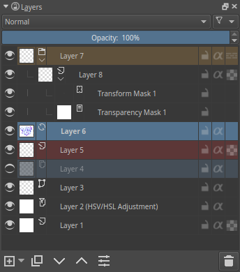
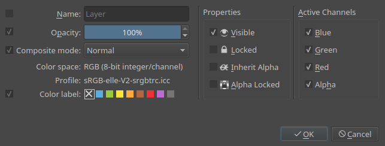

Layers
======

The Layers docker is for one of the core concepts of Krita: `Layer Management <Special:MyLanguage/Introduction_to_Layers_and_Masks>`__. 
You can add, delete, rename, duplicate and do many other things to layers here.

The Layer Stack
---------------

You can select the active layer here. Using :kbd:`Shift` and
:kbd:`Ctrl` you can select multiple layers and drag-and-drop them.
You can also change the visibility, edit state, alpha inheritance and
rename layers. You can open and close groups, and you can drag and drop
layers, either to reorder them, or to put them in groups.

Name
    The Layer name, just do + to make it editable, and press
    :kbd:`Enter` to finish editing.
Label
    This is a color that you can set on the layer. the layer to get a
    context menu to assign a color to it. You can then later filter on
    these colors.
Blending Mode
    This will set the `Blending Mode <Special:MyLanguage/Blending_Modes>`__ of the layer.
Opacity
    This will set the opacity of the whole layer.
Visibility
    An eye-icon. Clicking this can hide a whole layer.
Edit State (Or layer Locking)
    A lock Icon. Clicking this will prevent the layer from being edited,
    useful when handling large amounts of layers.
Alpha Lock
    This will prevent the alpha of the layer being edited. In more plain
    terms: This will prevent the transparency of a layer being changed.
    Useful in colouring images.
Pass-through mode
    Only available on Group Layers, this allows you to have the blending
    modes of the layers within affect the layers outside the group.
    Doesn't work with masks currently, therefore these have a
    strike-through on group layers set to pass-through.
Alpha Inheritance
    This is kinda difficult to explain. Basically, this will use the
    alpha of all the peers of this layer as a transparency mask. (This
    WILL need and image)
Open or Close Layers
    (An Arrow Icon) This will allow you to access sub-layers of a layer.
    Seen with masks and groups.
Onion Skin
    This is only available on `animated
    layers <Special:MyLanguage/Animation>`__, and toggles the onion skin
    feature.
Layer Style
    This is only available on layers which have a `layer style <Special:MyLanguage/Layer_Styles>`__ assigned. 
    The button allows you to switch between on/off quickly.

To edit these properties on multiple layers at once, press the
properties option when you have multiple layers selected or press
:kbd:`F3` There, to change the names of all layers, the checkbox
before should be ticked after which you can type in a name. Krita will
automatically add a number behind the layer-names. You can change other
layer properties like visibility, opacity, lock states etc too.

Lower buttons
-------------

These are buttons for doing layer operations.

Add
    Will by default add a new Paint Layer, but using the little arrow,
    you can call a sub-menu with the other layer types.
Duplicate
    Will Duplicate the active layer(s). Can be quickly invoked with
    :kbd:`Ctrl` ++drag.
Move layer up.
    Will move the active layer up. Will switch them out and in groups
    when coming across them.
Move layer down.
    Will move the active layer down. Will switch them out and in groups
    when coming across them.
Layer properties.
    Will open the layer properties window.
Delete
    Will delete the active layer(s). For safety reasons, you can only
    delete visible layers.

Hot keys and Sticky Keys
------------------------

-  :kbd:`Shift` and :kbd:`Ctrl` for selecting multiple layers.
-  :kbd:`Ctrl` ++drag - makes a duplicate of the selected layers, for
   you to drag and drop.
-  :kbd:`Ctrl + E` for merging a layer down. This also
   merges selected layers, layer styles and will keep selection masks in
   tact. Using :kbd:`Ctrl + E` on a single layer with a
   mask will merge down the mask into the layer.
-  :kbd:`Ctrl + Shift + E` merges all layers.
-  :kbd:`R` + allows you to select layers on canvas, similar to
   picking colours directly on canvas. Use
   :kbd:`Shift + R` + for multiple layers.
-  :kbd:`Ins` for adding a new layer.
-  :kbd:`Ctrl + G` will create a group layer. If multiple
   layers are selected, they are put into the group layer.
-  :kbd:`Ctrl + Shift + G` will quickly set-up a
   clipping group, with the selected layers added into the group, and a
   new layer added on top with alpha-inheritance turned on, ready for
   painting!
-  :kbd:`Ctrl + Alt + G` will ungroup layers inside a group.
-  :kbd:`Alt` + on the thumbnail for isolated view of a layer. This
   will maintain between layers till the same action is repeated again.
-  :kbd:`Shift` + on the eye-icon for hidding all but the current
   layer.
-  :kbd:`Page Up` and :kbd:`Page Down` for switching between layers.
-  :kbd:`Ctrl + Page Up` and :kbd:`Ctrl + Page Down` 
   will move the selected layers up and down.

