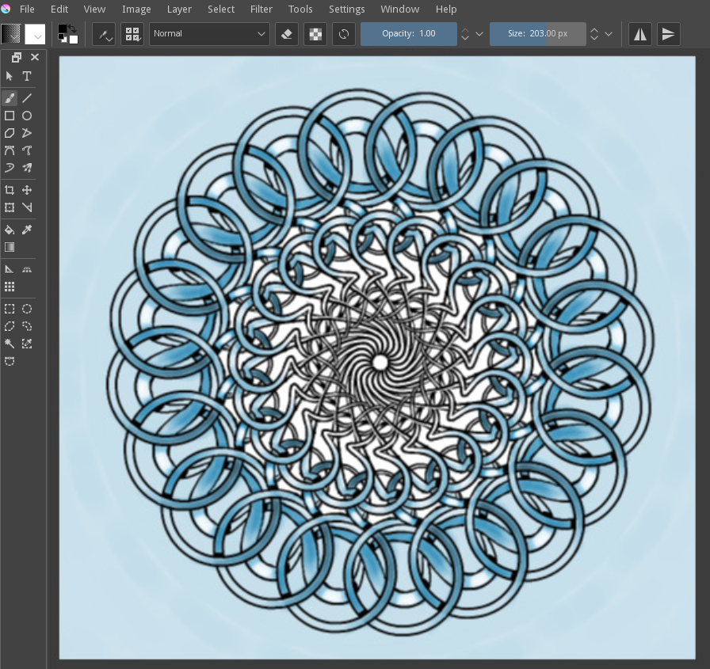

Multibrush Tool
===============

.. figure:: images/multibrush_tool/32px-Krita_tool_multibrush.png
   :alt: images/multibrush_tool/32px-Krita_tool_multibrush.png

The Multibrush tool allows you to draw using multiple instances of a
brush at once. It can be accessed from the tools bar. You can use any
brush with the Multibrush tool.

The settings for the tool will be found in the tool options dock.

The multibrush tool has three modes and the settings for each can be
found in the tool options dock. Symmetry and mirror reflect over an axis
which can be set in the tool options dock. The default axis is the
center of the canvas.

The three modes are:

Symmetry
    Symmetry will reflect your brush around the axis at even intervals.
    The slider determines the number of instances which will be drawn on
    the canvas.
Mirror
    Mirror will reflect the brush across the X axis, the Y axis, or
    both.
Translate
    Translate will paint the set number of instances around the cursor
    at the radius distance.
Snowflake
    This works as a mirrored symmetry, but is a bit slower than
    symmetry+toolbar mirror mode.

The assistant and smoothing options work the same as in the 
:doc:`freehand brush tool <Freehand_Brush_Tool>`, though only on
the real brush and not it's copies.

