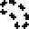
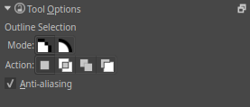

Outline Selection Tool
======================

Make a selection by drawing freehand around the canvas. Click and drag
to draw a border around the section you wish to select.

Hotkeys and Sticky keys
-----------------------

-  :kbd:`R` sets the selection to 'replace' in the tool options, this is the default mode.
-  :kbd:`A` sets the selection to 'add' in the tool options.
-  :kbd:`S` sets the selection to 'subtract' in the tool options.
-  :kbd:`Shift` + sets the subsequent selection to 'add'. You can
   release :kbd:`Shift` while dragging, but it will still be set to
   'add'. Same for the others.
-  :kbd:`Alt` + sets the subsequent selection to 'subtract'.
-  :kbd:`Shift` + :kbd:`Alt` + sets the subsequent selection to
   'intersect'.

-  :kbd:`Ctrl` + turn Outline Selection Tool into Polygonal Selection Tool.

.. Note::

   You can switch the behaviour of the Alt key to use Ctrl instead by toggling 
   the switch in the [[Special:MyLanguage/General_Settings#Tool_options|general settings]]

Tool Options
------------

Anti-aliasing
    This toggles whether or not to give selections feathered edges. Some
    people preffer hard-jagged adges for their selections.

