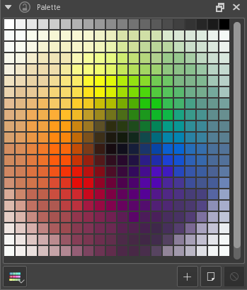

Palette
=======

The palette docker displays various color swatches for quick use.

You can choose from various default palette or you can add your own
colors to the palette.

To choose from the default palettes click on the icon in the bottom left
corner of the docker, it will show a list of pre-loaded color palette
you can click on one and load it, or click on import resources (folder
icon) to load your own color palette.

To load particular color swatch to the palette choose a color from any
color selector and click on the **+** icon in the bottom right corner of
the docker. To delete a color swatch, you have to just select the color
swatch and click on **-** icon.

If you find the size of color swatches too small, you can increase the
size by hovering your mouse over the palette and scrolling while holding
:kbd:`Ctrl`.

To make a new palette, go to the palette list, and type in a name at the
bottom. Then press 'save' and navigate to the palette to start filling
it up.

