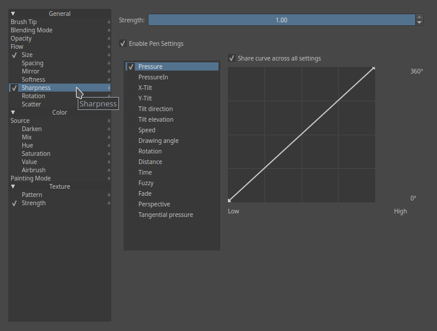

Parameters
==========

Airbrush
--------

If you hold the brush still, but are still pressing down, this will keep
adding colour onto the canvas. The lower the rate, the quicker the
colour gets added.

Mirror
------

This allows you to mirror the Brush-tip with Sensors.

Horizontal
    Mirrors the mask horizontally.
Vertical
    Mirrors the mask vertically.

Some examples of mirroring and using it in combination with
`#Rotation <#Rotation>`__.

Rotation
--------

This allows you to affect Angle of your brush-tip with Sensors.

In the above example, several applications of the parameter.

#. Drawing Angle - A common one, usually used in combination with
   rake-type brushes. Especially effect because it does not rely on
   tablet-specific sensors. Sometimes, Tilt-Direction or Rotation is
   used to achieve a similar-more tablet focussed effect, where with
   Tilt the 0° is at 12 o'clock, Drawing angle uses 3 o'clock as 0°.
#. Fuzzy - Also very common, this gives a nice bit of randomness for
   texture.
#. Distance - With careful editing of the Sensor curve, you can create
   nice patterns.
#. Fade - This slowly fades the rotation from one into another.
#. Pressure - An interesting one that can create an alternative looking
   line.

Scatter
-------

This parameter allows you to set the random placing of a brush-dab. You
can affect them with Sensors.

X
    The scattering on the angle you are drawing from.
Y
    The scattering, perpendicular tot he drawing angle(has the most
    effect)

Sharpness
---------

Puts a threshold filter over the brush mask.

.. Note::

   Doesn't work with the mirror modifier at 1px

Size
----

This parameter is not the diameter itself, but rather the curve for how
it's affected.

So, if you want to lock the diameter of the brush, lock the Brush-tip.
Locking the size parameter will only lock this curve. Allowing this
curve to be affected by the Sensors can be very useful to get the right
kind of brush. For example, if you have trouble drawing fine lines, try
to use a concave curve set to pressure. That way you'll have to press
hard for thick lines.

Also popular are setting the size to the sensor fuzzy or perspective,
with the later in combination with a `Perspective
Assistant <Special:myLanguage/Krita/Manual/AdvancedPainting#Perspective>`__

Softness
--------

This allows you to affect Fade with Sensors.

Has a slight brush-decreasing effect, especially noticeable with
soft-brush, and is overall more noticeable on large brushes.

Source
------

Picks the source-colour for the brush-dab.

Plain Color
    Current foreground color.
Gradient
    Picks active gradient
Uniform Random
    Gives a random colour to each brush dab.
Total Random
    Random noise pattern is now painted.
Pattern
    Uses active pattern, but alignment is different per stroke.
Locked Pattern
    Locks the pattern to the brushdab

Mix
~~~

Allows you to affect the mix of the `Source <#Source>`__ color with
Sensors. It will work with Plain Color and Gradient as source. If Plain
Color is selected as source, it will mix between foreground and
background colors selected in color picker. If Gradient is selected, it
chooses a point on the gradient to use as painting color according to
the sensors selected.

.. figure:: images/parameters/Krita_2_9_brushengine_mix_01.png
   :alt: images/parameters/Krita_2_9_brushengine_mix_01.png

**Uses**

Flow map
    The above example uses a *Krita* painted flowmap in the 3d program
    *Blender*.

a brush was set to source Gradient and Mix:Drawing angle. The gradient
in question contained the 360° for normal map colours. Flow maps are
used in several Shaders, such as brushed metal, hair and certain
river-shaders.

Gradient
~~~~~~~~

Exactly the same as using Source:Gradient with Mix, but only available
for the Color Smudge Brush.

Spacing
-------

This allows you to affect `Auto
Brush-tip <Special:MyLanguage/Brush_Tips>`__ with
`Sensors <Special:MyLanguage/Sensors>`__.

Isotropic.
    Instead of the spacing being related to the ratio of the brush, it
    will be on diameter only.

Ratio
-----

Allows you to change the ratio of the brush and bind it to parameters.
This also works for predifined brushes.

