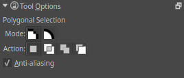

Polygonal Selection Tool
========================

This tool, represented by a polygon with a dashed border, allows you to
make a selection of a polygonal area point by point. Click where you
want each point of the Polygon to be. Double click to end your polygon
and finalize your selection area.

Hotkeys and Stickykeys
----------------------

-  :kbd:`R` sets the selection to 'replace' in the tool options, this is the default mode.
-  :kbd:`A` sets the selection to 'add' in the tool options.
-  :kbd:`S` sets the selection to 'subtract' in the tool options.
-  :kbd:`Shift + Z` removes the last added point.
-  :kbd:`Shift +` sets the subsequent selection to 'add'. You can
   release the :kbd:`Shift` key while dragging, but it will still be
   set to 'add'. Same for the others.
-  :kbd:`Alt +` sets the subsequent selection to 'subtract'.
-  :kbd:`Ctrl +` sets the subsequent selection to 'replace'.
-  :kbd:`Shift + Alt +` sets the subsequent selection to 'intersect'.

.. Note::

   You can switch the behaviour of the Alt key to use Ctrl instead by
   toggling the switch in the [[Special:MyLanguage/General_Settings#Tool_options|general settings]]}}

Tool Options
------------

Anti-aliasing
    This toggles whether or not to give selections feathered edges. Some
    people preffer hard-jagged adges for their selections.

