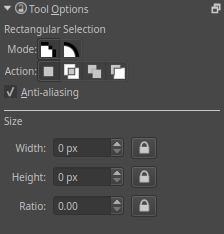

Rectangular Selection Tool
==========================

This tool, represented by a rectangle with a dashed border, allows you
to make a selection of a rectangular area. Simply click and drag around
the section you wish to select.

Hotkeys and Stickykeys
----------------------

-  :kbd:`Ctrl + R` selects this tool.
-  :kbd:`R` sets the selection to 'replace' in the tool options, this is the default mode.
-  :kbd:`A` sets the selection to 'add' in the tool options.
-  :kbd:`S` sets the selection to 'subtract' in the tool options.

-  :kbd:`Shift` after starting the selection, constraints it to a perfect square.
-  :kbd:`Ctrl` after starting the selection, makes the selection resize from center.
-  :kbd:`Alt` after starting the selection, allows you to move it.

-  :kbd:`Shift` + sets the subsequent selection to 'add'. You can
   release the :kbd:`Shift` key while dragging, but it will still be
   set to 'add'. Same for the others.
-  :kbd:`Alt` + sets the subsequent selection to 'subtract'.
-  :kbd:`Ctrl` + sets the subsequent selection to 'replace'.
-  :kbd:`Shift` + :kbd:`Alt` + sets the subsequent selection to 'intersect'.

.. Note::

   So to subtract a perfect square, you do :kbd:`Alt +`, then
   release the :kbd:`Alt` key while dragging and press :kbd:`Shift` to constrain.

.. Note::

   You can switch the behaviour of the Alt key to use Ctrl instead by toggling 
   the switch in the [[Special:MyLanguage/General_Settings#Tool_options|general settings]]

Tool Options
------------

Anti-aliasing
    This toggles whether or not to give selections feathered edges. Some
    people preffer hard-jagged adges for their selections.
Width
    Gives the current width. Use the lock to force the next selection
    made to this width.
Height
    Gives the current height. Use the lock to force the next selection
    made to this height.
Ratio
    Gives the current ratio. Use the lock to force the next selection
    made to this ratio.

