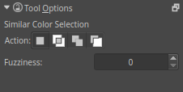

Similar Color Selection Tool
============================

This tool, represented by a dropper over an area with a dashed border,
allows you to make a selection by selecting a point of color. It will
select any areas of a similar color to the one you selected. You can
adjust the “fuzziness” of the tool in the tool options dock. A lower
number will select colors closer to the color that you chose in the
first place.

Hotkeys and Sticky keys
-----------------------

-  :kbd:`R` sets the selection to 'replace' in the tool options, this is the default mode.
-  :kbd:`A` sets the selection to 'add' in the tool options.
-  :kbd:`S` sets the selection to 'subtract' in the tool options.
-  :kbd:`Shift` + sets the subsequent selection to 'add'. You can
   release the :kbd:`Shift` key while dragging, but it will still be
   set to 'add'. Same for the others.
-  :kbd:`Alt` + sets the subsequent selection to 'subtract'.
-  :kbd:`Ctrl` + sets the subsequent selection to 'replace'.
-  :kbd:`Shift` + :kbd:`Alt` + sets the subsequent selection to 'intersect'.

.. Note::

   You can switch the behaviour of the Alt key to use Ctrl instead by toggling
   the switch in the [[Special:MyLanguage/General_Settings#Tool_options|general settings]]

Tool Options
------------

Fuziness
    This toggles whether or not the contiguous selection sees another
    color as a border.

