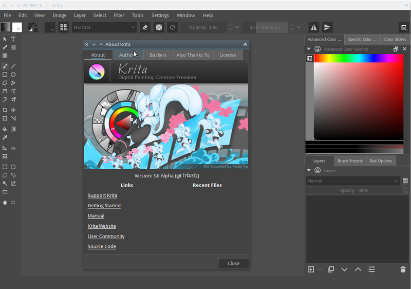
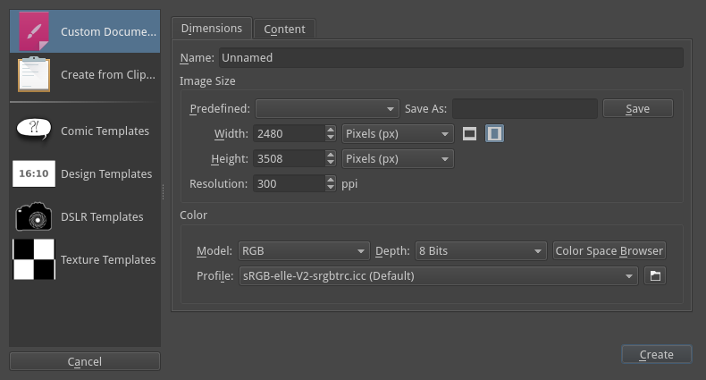
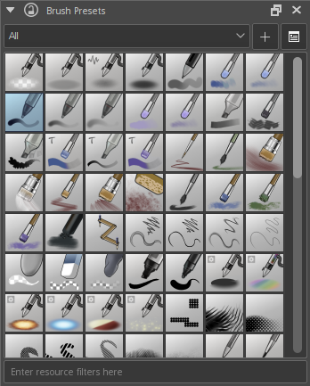

Starting Krita
==============

There will be no canvas or new document open by default. To create a new
canvas you have create a new document from the File menu. If you want to
open an existing image, either use :menuselection:`File --> Open`
or drag the image from your computer into Krita's window.

.. contents:: Contents
   :local:

Creating a New Document
-----------------------

A new document can be created as follows

#. Click on File from the application menu at the top.
#. Then click on 'New'. Or you can do this by pressing :kbd:`Ctrl + N`
#. Now you will get a New document dialog box as shown below

Krita is a pretty complex program that can handle a lot of different
files, so let's go past this step by step:

Recent Document
~~~~~~~~~~~~~~~

You can view and open a list of recently opened documents from this
section

Custom Document
~~~~~~~~~~~~~~~

From this section you can create a document according to your
requirement. i.e you can specify the Dimensions, Color model, Depth,
Resolution etc.

In the top-most field is you can define a name for your new document.
This name will appear in the metadata of the file, as well, Krita will
use it for the auto-save functionality. You can leave it empty, then it
will be referred to as 'unnamed' by- default.

From the predefined drop-down you can select predefined pixel-sizes, and
the PPI (pixels per inch).

You can set custom dimensions and the orientation of the document from
the input fields below the predefined drop-down. This can also be saved
as a new predefined preset for your future use by giving a name in 'save
predefined as' field and clicking on the save button.

In the second tab we find the color section of the new document dialog
box you can also select the color model and the bit-depth. Check Color
Management for more info.

From the content section you can also select the background color and
the amount of layers you want in the new document.

Krita remembers the amount of layers you picked last time, so be
careful.

Finally, there's a description box, useful to note down what you are
going to do.

Create From Clipboard:
~~~~~~~~~~~~~~~~~~~~~~

This section allows you to create a document from an image that is in
your clipboard like a screenshot. It will have all the fields set to
match the clipboard image.

Templates:
~~~~~~~~~~

These are separate categories where we deliver special defaults.

Templates are just \*.kra files which are saved in a special location so
it can be pulled up by Krita quickly.

You can make your own template file from any \*.kra file, by using
'create template from image' in the file menu. This will add your
current document as a new template, including all its properties along
with the layers and layer contents.

Once you created a new document according to your preference you should
now have a white canvas in front of you.

How to use brushes
------------------

Now, just press on the canvas part. If everything's correct, you should
be able to draw on the canvas! By default when you start Krita the brush
tool should be selected, but if for some reason it is not , you can
click on this |Krita_tool_freehand.png| Icon from the toolbar and activate the brush tool.

Of course, you'd want to use different brushes. On your right, there's a
docker named Brush Presets(or on top, press :kbd:`F6` to find this
one) with all these cute squares with pens and crayons.

If you want to tweak the presets, check the Brush Editor in the toolbar.
You can also access the Brush Editor with :kbd:`F5`.

Tick on any of the squares to choose a brush, and then draw on the
canvas. To change colour, tick the triangle in the Advanced Color
Selector docker.

Erasing
-------

There are brush presets for erasing, but it is often faster to use the
eraser toggle. By toggling the :kbd:`E` key, your current brush
switches between erasing and painting.

This erasing method works with most of the tools. You can erase using
the line tool, rectangle tool, and even the gradient tool.

Saving and opening files
------------------------

Now, once you have figured out how to draw something in Krita, you may
want to save it.

The save option is in the same place as it is in all other computer
programs: The top-menu of :menuselection:`File`, and then
:menuselection:`Save`.

Select the folder you want to have your drawing, and select the file
format you want to use ('.kra' is Krita's default format, and will save
everything). And then hit :menuselection:`Save`.

Some older versions of Krita have a bug and require you to manually type
the extension. If you want to show of your image on the internet, check
out the `Saving for the Web <Special:MyLanguage/Saving_for_the_Web>`__
tutorial.

Check out :doc:`Interface <Navigation>` for further
basic information, :doc:`Basic Concepts<Basic_Concepts>` for an introduction as
Krita as a medium, or just go out and explore Krita!

