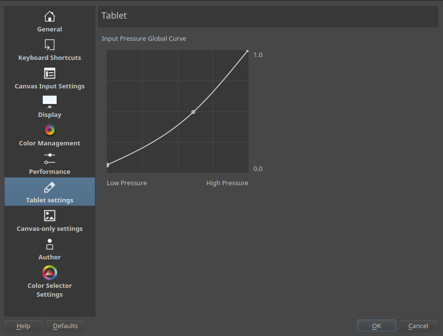

Tablet Settings
===============

Tablet
    Input Pressure Global Curve : This is the global curve setting that
    your tablet will use in Krita. The settings here will make your
    tablet feel soft or hard globally.

If your tablet doesn't work with Krita, check out the
:doc:`page on drawing tablets <Drawing_Tablets>`.

External Links
--------------

`David Revoy wrote an indepth guide on using this feature to maximum advantage. <http://www.davidrevoy.com/article182/calibrating-wacom-stylus-pressure-on-krita>`__

