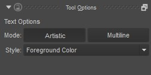

Text Tool
=========

Add text to your artwork. There are two different ways to add text:
Artistic and Multiline. Multiline text is useful for large bodies of
content that need word wrapping. Artistic text is useful when you want
to conver the letters to vector anchor points and modify them. Select
which type of text you want before you create the object on the canvas.
The result will go on a vector layer.

.. raw:: mediawiki

   {{Info| Currently the text tool is in for a full overhaul. So we are waiting for these changes to land till we write proper docs.}}

Tool Options
------------

